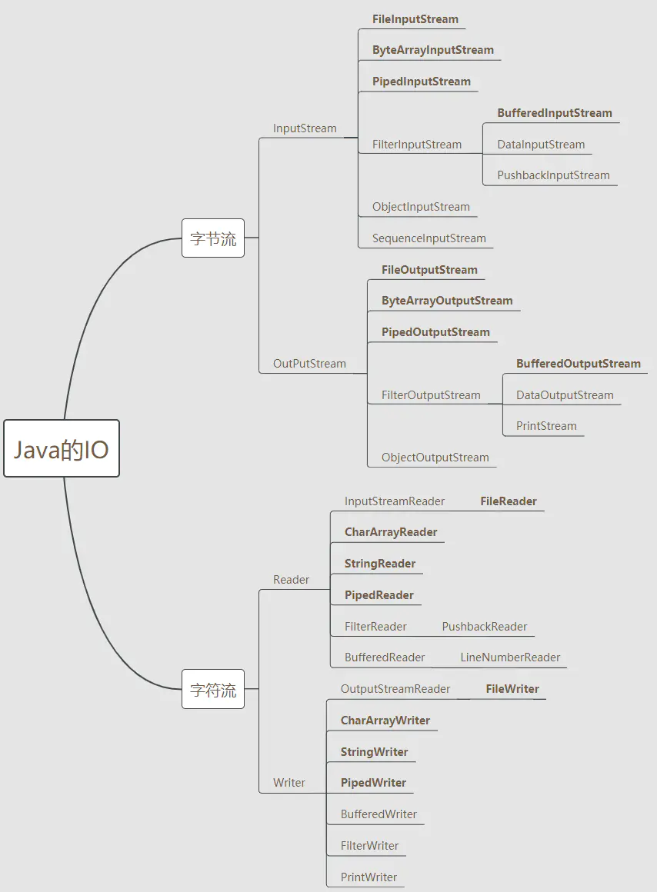
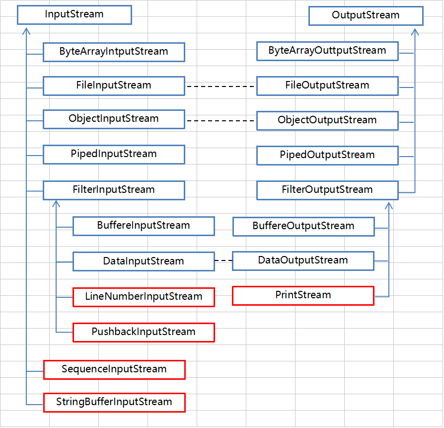
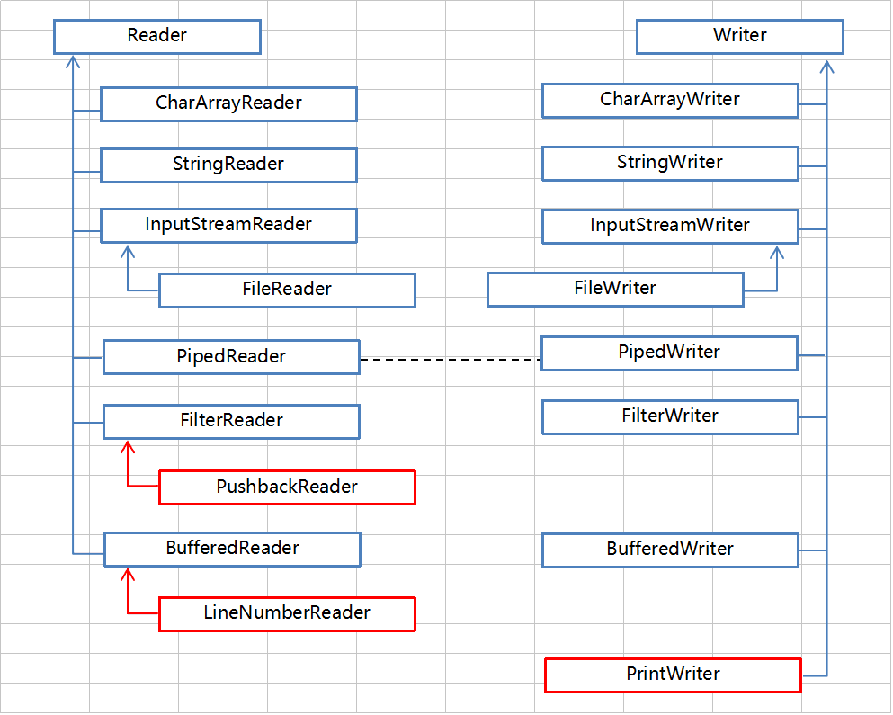
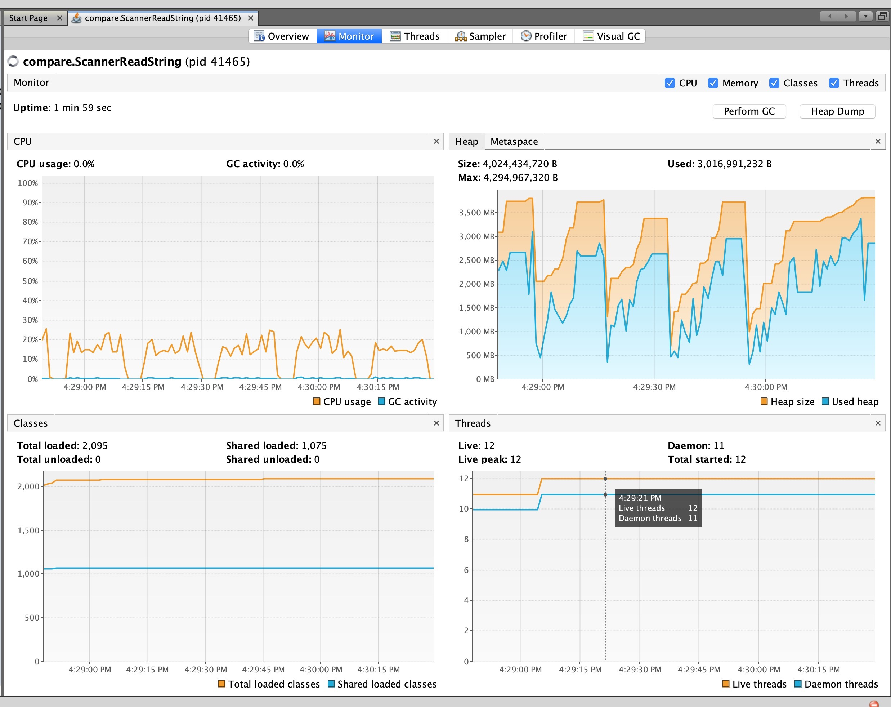
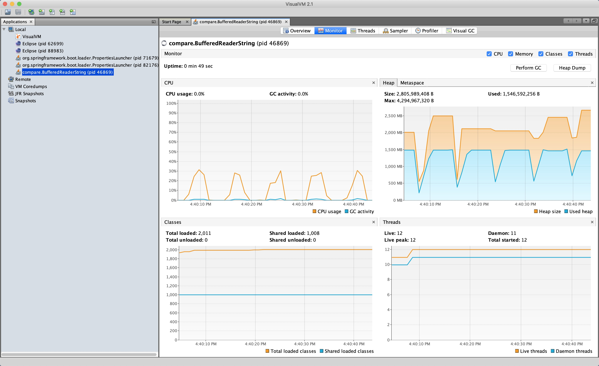
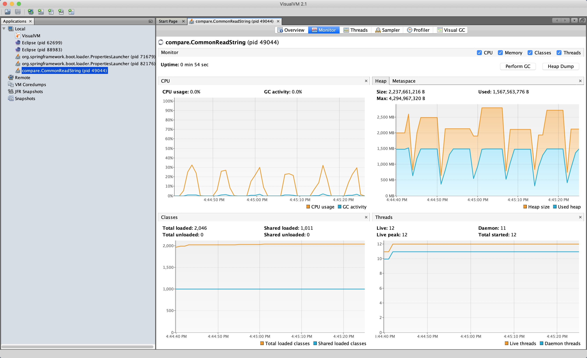
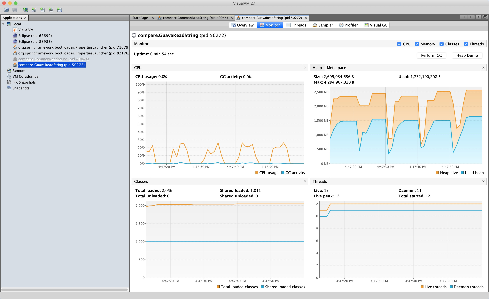
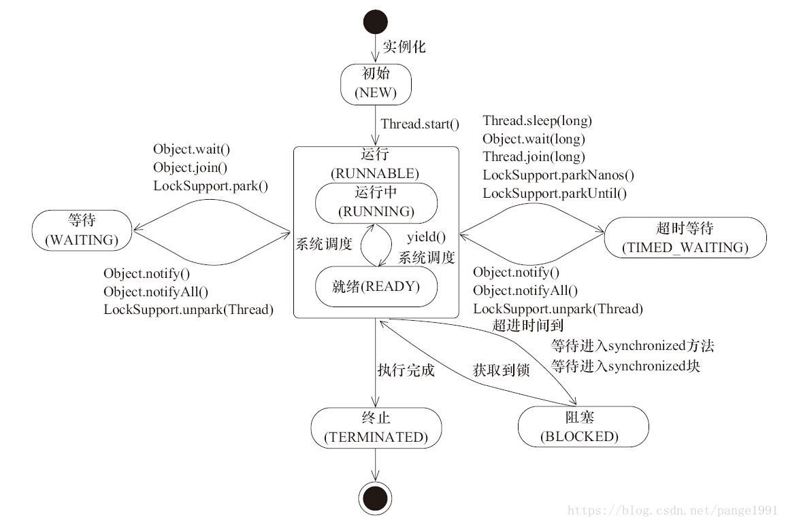

# IO
## IO 简介
IO 指外部设备与内存之间的数据交换。

## IO流 分类
- 根据数据流向不同分为：输入流和输出流
- 根据处理数据类型的不同分为：字节流和字符流  

java IO流有以下的类  


字节流输入输出的对应关系如下图所示  


字符流输入输出的对应关系如下图所示  


[参考文档](https://zhuanlan.zhihu.com/p/25418336)  
## NIO （New IO）
NIO 是 java IO 和 Networking API 的替代品，提供了一个不同的 IO 编程模型。

## IO 与 NIO 对比
[参考博客](http://tutorials.jenkov.com/java-nio/nio-vs-io.html)  
 **IO**    | **NIO**                             
-----------|-------------------------------------
 面向 Stream | 面向 Buffer                           
 阻塞的IO     | 提供非阻塞的IO                            
 不支持       | Selector 允许单个线程监视 input 的多个 Channel 
  
### API 调用方面
NIO 需要先将数据读入缓冲区，然后再从缓冲区进行处理，而不是从输入流中逐字节读取数据。

### 数据处理方面
由于 NIO 是将字节从通道读入 ByteBuffer ，当该方法调用返回时，不知道所需的所有数据是否都在缓冲区内。需要循环检查缓冲区中的数据是否满足需求才能进行处理。


## 实验设置（对比 NIO、Common-IO、Guava）
使用 `dd if=/dev/urandom of=file_xx count=$[1024 * xx] bs=1024` 创建不同大小的文件用于读取  
Charset 编码集统一使用 "ISO-8859-1"  
[对比实验代码仓](https://github.com/brosoul/java_explore.git)  

jar 版本如下：  
- JRE 16.02
- commons-io-2.11.0
- guava-31.0.1-jre

启动参数：  
设置程序运行期间最大可占用的内存为 4096m，其余为 vscode 默认参数设置。  
-agentlib:jdwp=transport=dt_socket,server=n,suspend=y,address=localhost:57178
-Xmx4096m
-XX:+HeapDumpOnOutOfMemoryError
--enable-preview
-XX:+ShowCodeDetailsInExceptionMessages
-Dfile.encoding=UTF-8


对比 java.util.Scanner、java.io.BufferedReader、java.nio.file.Files、org.apache.commons.io.FileUtils、com.google.common.io.Files 五种方法读取文件（按行读取，并存储到 List<String> 中）的性能开销。

### 实验结果
CPU 峰值记录在类一列。  

读取 1g 文件( readLines )  
 **读取时间(ms)/内存使用(m)/CPU峰值** | **第一次**    | **第二次**    | **第三次**    | **第四次**    | **第五次**    
----------------------------|------------|------------|------------|------------|------------
 Scanner(24%)               | 14553/2678 | 14292/2595 | 14254/2646 | 14747/2962 | 14459/1843 
 BufferedReader(31.7%)      | 2725/1489  | 2781/1504  | 2616/1476  | 2677/1446  | 2639/1556  
 NIO(32.7%)                 | 2689/1500  | 3249/1520  | 2700/1494  | 2824/1540  | 2761/1510  
 Common(32.9%)              | 2582/1484  | 2854/1518  | 2714/1504  | 2780/1524  | 2676/1494  
 Guava(26.6%)               | 5827/1486  | 4672/1561  | 4747/1519  | 4629/1534  | 5031/1652    


Visual VM 结果  
依次为 Scanner、BufferedReader、NIO、Common、Guava  







### 分析原因
NIO、Common-IO 中的 readLines 底层都是使用 BufferedReader.readLines 进行读取，所以三者读取的性能所差无几。三者的不同之处主要是在构建 BufferedReader 过程中出现。这里不做分析。BufferedReader 中默认会有一个长度为 8K 的 char[] buffer。在读取过程中，会先将 buffer 填满，然后每次的 read 操作都是到 buffer 中进行读取，否则每次读取要从文件中读取字节，将其转换为字符，然后返回，这可能非常低效。  
Scanner 在读取文件中，在匹配下一个换行符时会将匹配的结果加入到一个缓存中，直到换行符被匹配到，将返回匹配到的结果。Scanner 在读大文件时效率是最低的，消耗内存也远大于另外的方法。  
Guava 读取文件时，使用一个 2K 大小的缓冲区 buffer 来缓存文件内容，使用 LineBuffer 对每个 buffer 的内容进行是否是换行符的判断，是的话将，行加入到 lines Queue 中，循环读出。  

Guava 虽然读取速度没有 NIO、Common-IO 以及 BufferedReader 快，但是其封装的处理方法十分优雅。在处理过程中可以在 readLines 中传入 LineProcessor 来表示每一行的处理逻辑。

<hr>

# thread
## 线程的状态
- 新建 初始化
- 可运行（Running、Ready）
- 阻塞 
- 等待
- 超时等待
- 终止  
线程状态间的转换关系如下图  


## stop resume 弃用原因
[参考文档](https://docs.oracle.com/javase/9/docs/api/java/lang/doc-files/threadPrimitiveDeprecation.html)  
stop 
> Because it is inherently unsafe. Stopping a thread causes it to unlock all the monitors that it has locked. (The monitors are unlocked as the ThreadDeath exception propagates up the stack.) If any of the objects previously protected by these monitors were in an inconsistent state, other threads may now view these objects in an inconsistent state. Such objects are said to be damaged. When threads operate on damaged objects, arbitrary behavior can result. This behavior may be subtle and difficult to detect, or it may be pronounced. Unlike other unchecked exceptions, ThreadDeath kills threads silently; thus, the user has no warning that his program may be corrupted. The corruption can manifest itself at any time after the actual damage occurs, even hours or days in the future.
suspend、resume
> Thread.suspend is inherently deadlock-prone. If the target thread holds a lock on the monitor protecting a critical system resource when it is suspended, no thread can access this resource until the target thread is resumed. If the thread that would resume the target thread attempts to lock this monitor prior to calling resume, deadlock results. Such deadlocks typically manifest themselves as "frozen" processes.

## intrrupt 
interrupt()只是会设置线程的中断标志位，在等待和超时等待的状态时会捕获到 InterruptedException 异常；处于新建和终止状态的线程，没有任何效果，中断标志位也不会被设置；线程在等待锁状态，使用 interrupt 并不会使它从锁等待队列中出来。  
在 IO 的操作中，对于实现了 java.nio.channels.InterruptibleChannel 的 Channel，因调用某个阻塞的 IO 操作进入阻塞状态，如果使用了 interrupt ，该通道会关闭并收到 ClosedByInterruptException 异常；线程处于 Selector 阻塞状态，会设置中断标志位，并立即返回。（IO 这块的阻塞还未验证出来）

## while true 线程优雅退出

```java
// 通过改变某个共享对象的值来通知线程退出
while(true){
  if(condition){
    break;
  }
  ...
}

// 通过interrupt某个线程使其退出
 while(true){
     if(Thread.currentThread().isInterrupted()){
         break;
     }
     ...
 }

```

<style >
img{
  width: 500px;
  height: 400px;
}

</style>